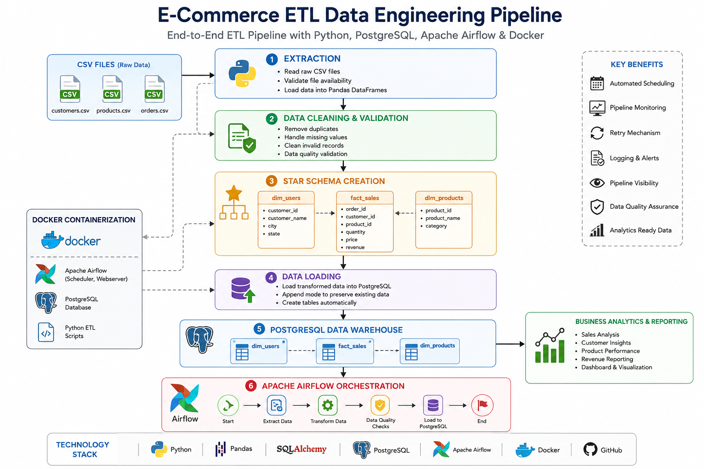
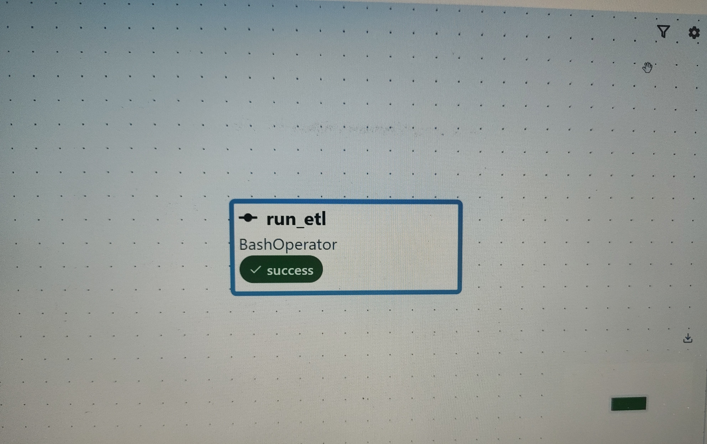
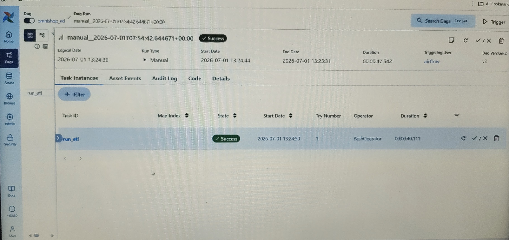
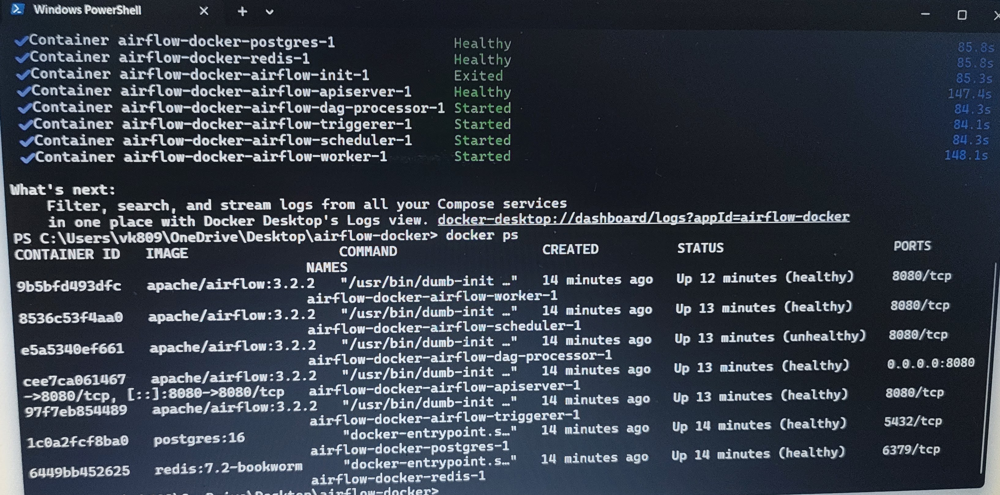
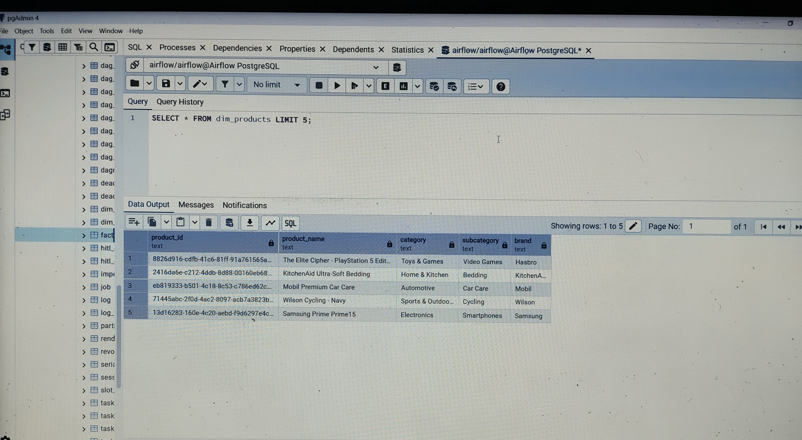

# 🚀 E-Commerce ETL Data Engineering Pipeline

## 🧠 End-to-End Data Engineering Project

### Building a Modern ETL Pipeline with Python, PostgreSQL, Apache Airflow & Docker

⭐ If you enjoy Data Engineering, ETL Pipelines, Data Warehousing, and Analytics projects, consider starring this repository.

**Python | PostgreSQL | Apache Airflow | Docker | SQL | ETL | Data Warehouse**

---

# 📌 About This Project

E-Commerce ETL Pipeline is an end-to-end Data Engineering project that demonstrates how raw e-commerce data can be transformed into a structured analytics-ready PostgreSQL Data Warehouse using Python, Apache Airflow, and Docker.

The project follows industry-standard ETL practices and includes:

✅ Data Extraction

✅ Data Cleaning & Transformation

✅ Data Quality Validation

✅ Star Schema Modeling

✅ Data Loading into PostgreSQL

✅ Workflow Orchestration using Apache Airflow

✅ Containerization using Docker

✅ Analytics-Ready Data Warehouse


---

# 📸 Project Screenshots

## 🏗️ Project Architecture

The following architecture illustrates the complete ETL workflow from raw CSV files to an analytics-ready PostgreSQL Data Warehouse.



---

## 🚀 Apache Airflow DAG

Apache Airflow DAG used to orchestrate and automate the ETL pipeline.



---

## ✅ Successful ETL Pipeline Execution

Successful execution of the ETL pipeline in Apache Airflow.



---

## 🐳 Docker Containers

Docker containers running all required services, including PostgreSQL, Redis, Airflow Scheduler, Webserver, Worker, and Triggerer.



---

## 🗄️ PostgreSQL Data Warehouse

PostgreSQL database containing the Star Schema tables (`dim_users`, `dim_products`, and `fact_sales`) used for analytics.


---

## 📊 SQL Analytics Queries

Example SQL queries executed on the PostgreSQL Data Warehouse to validate the ETL pipeline and analyze the processed data.




---

## 🚀 Getting Started

### 1. Clone the Repository

```bash
git clone https://github.com/viveksingh28aug/ecommerce-etl-pipeline.git
cd ecommerce-etl-pipeline
```

### 2. Configure Environment Variables

Create a `.env` file using `.env.example` and update your PostgreSQL credentials.

### 3. Start Docker Containers

```bash
docker compose up -d
```

### 4. Launch Apache Airflow

Open:

```
http://localhost:8080
```

### 5. Trigger the ETL DAG

Open the Apache Airflow UI, enable the `etl_dag` DAG, and click **Trigger DAG** to execute the ETL pipeline.

### 6. Verify PostgreSQL Tables

Connect to PostgreSQL and verify the `dim_users`, `dim_products`, and `fact_sales` tables.

---


# 📊 Project Snapshot

| Metric             | Value                 |
| ------------------ | --------------------- |
| Source Dataset     | E-Commerce Sales Data |
| Fact Table Records | 1,737                 |
| Customer Records   | 10,000                |
| Product Records    | 1,000                 |
| Database           | PostgreSQL            |
| Orchestration      | Apache Airflow        |
| Containerization   | Docker                |
| Language           | Python                |

---

# 🚀 Business Problem

E-commerce companies generate large amounts of transactional data every day.

Without a structured data pipeline:

* Data remains scattered across multiple files
* Reporting becomes difficult
* Analytics teams spend time cleaning data
* Business decisions become slower

This project solves these challenges by creating an automated ETL pipeline that converts raw data into a structured analytical model.

---

# 📂 Data Warehouse Design

## Fact Table

### fact_sales

Stores transactional sales information.

Columns:

* order_id
* customer_id
* product_id
* quantity
* price
* revenue

## Dimension Tables

### dim_users

Stores customer information.

Columns:

* customer_id
* customer_name
* city
* state

### dim_products

Stores product information.

Columns:

* product_id
* product_name
* category

---

# 🛠️ Technology Stack

## Programming

* Python
* SQL

## Data Processing

* Pandas
* NumPy

## Database

* PostgreSQL
* SQLAlchemy

## Workflow Orchestration

* Apache Airflow

## Containerization

* Docker
* Docker Compose

## Development Tools

* VS Code
* Git
* GitHub

---

# 📁 Project Structure

```text
ecommerce-etl-pipeline/
│
├── dags/
│   └── etl_dag.py
│
├── extract/
│   └── extract.py
│
├── transform/
│   └── transform.py
│
├── load/
│   └── load.py
│
├── quality/
│   └── quality_checks.py
│
├── config/
│   └── config.py
│
├── data/
│   ├── customers.csv
│   ├── products.csv
│   └── orders.csv
│
├── logs/
│
├── screenshots/
│   ├── airflow_dag.png
│   ├── airflow_success.png
│   ├── architecture.png
│   ├── docker_containers.png
│   ├── postgres_tables.png
│   └── sql_queries.png

├── requirements.txt
├── docker-compose.yml
├── .env.example
├── main.py
└── README.md
```

---

# ⚙️ ETL Workflow

## 1. Extract

* Read raw CSV files
* Validate file availability
* Load data into Pandas DataFrames

## 2. Transform

* Remove duplicates
* Handle missing values
* Clean invalid records
* Create revenue calculations
* Generate dimension tables
* Generate fact table

## 3. Load

* Load transformed data into PostgreSQL
* Preserve existing data using append-based loading
* Create tables automatically

## 4. Data Quality Checks

* Null value validation
* Row count verification
* Duplicate detection
* Schema validation

---

# 🔄 Apache Airflow Orchestration

The pipeline is automated using Apache Airflow.

### DAG Flow

```text
Start
  │
  ▼
Extract Data
  │
  ▼
Transform Data
  │
  ▼
Data Quality Checks
  │
  ▼
Load to PostgreSQL
  │
  ▼
End
```

Benefits:

* Automated Scheduling
* Monitoring
* Retry Mechanism
* Logging
* Pipeline Visibility

---

# 📈 Sample Analytics Queries

## Top 10 Best Selling Products

```sql
SELECT product_id,
       SUM(quantity) AS total_quantity
FROM fact_sales
GROUP BY product_id
ORDER BY total_quantity DESC
LIMIT 10;
```

## Total Revenue

```sql
SELECT SUM(total_amount) AS total_revenue
FROM fact_sales;
```

## Customer Purchase Analysis

```sql
SELECT user_id,
       COUNT(order_id) AS total_orders
FROM fact_sales
GROUP BY user_id
ORDER BY total_orders DESC;
```

---

# 💼 Data Engineering Skills Demonstrated

### ETL Development

* Data Extraction
* Data Transformation
* Data Loading

### Data Warehousing

* Star Schema
* Fact & Dimension Modeling

### Database Engineering

* PostgreSQL
* SQL Querying

### Workflow Automation

* Apache Airflow
* DAG Development

### Data Quality

* Validation Checks
* Error Handling
* Logging

### DevOps

* Docker
* Docker Compose

---

# 🎯 Key Achievements

✔ Built a complete ETL pipeline

✔ Designed a Star Schema Data Warehouse

✔ Loaded data into PostgreSQL

✔ Automated workflows using Airflow

✔ Containerized the project with Docker

✔ Implemented logging and data quality checks

✔ Created analytics-ready tables

---

# 🔮 Future Improvements

* True Incremental Data Loading
* AWS S3 Integration
* Snowflake Data Warehouse
* Apache Spark Processing
* dbt Transformations
* Power BI Dashboard
* CI/CD Pipeline
* Kafka Streaming Integration

---

# 👨‍💻 Author

## Vivek Kumar

Aspiring Data Engineer passionate about building scalable data pipelines, cloud-based data platforms, and analytics solutions.

### Core Skills

Python • SQL • PostgreSQL • Apache Airflow • Docker • ETL • Data Warehousing • Data Modeling • Git • Data Engineering

---

# ⭐ Support

If you find this project useful:

⭐ Star the repository

🍴 Fork the repository

📢 Share it with others

💼 Connect and collaborate

> "Data is valuable only when it is transformed into actionable insights."

🚀 Building Scalable Data Engineering Solutions One Pipeline at a Time.


Reviewed Branch update
